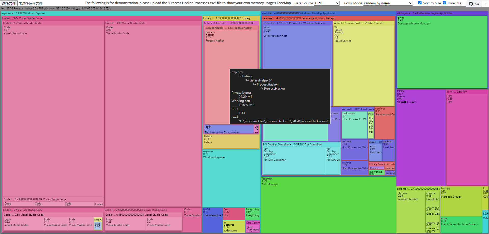
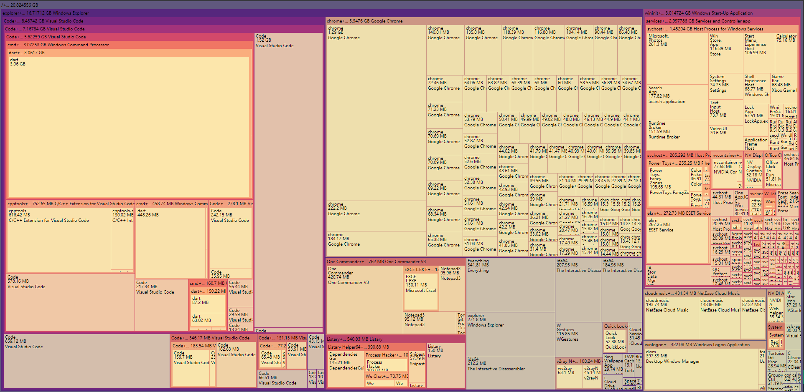

# Memory/CPU TreeMap for [ProcessHacker(System Informer)](https://github.com/processhacker/processhacker)/[Process Explorer](https://learn.microsoft.com/en-us/sysinternals/downloads/process-explorer)

This repo is used to help explain for "[[Feature request] TreeMap View for Memory Usage](https://github.com/processhacker/processhacker/issues/1008)" 

## ***Try this online*** 👉[https://krysl.github.io/ProcessHacker_TreeMap/](https://krysl.github.io/ProcessHacker_TreeMap/) (gh-pages)

The image below use CSV data exported by ProcessHacker:

(Because I’m too lazy, there may not be any further updates to this page)